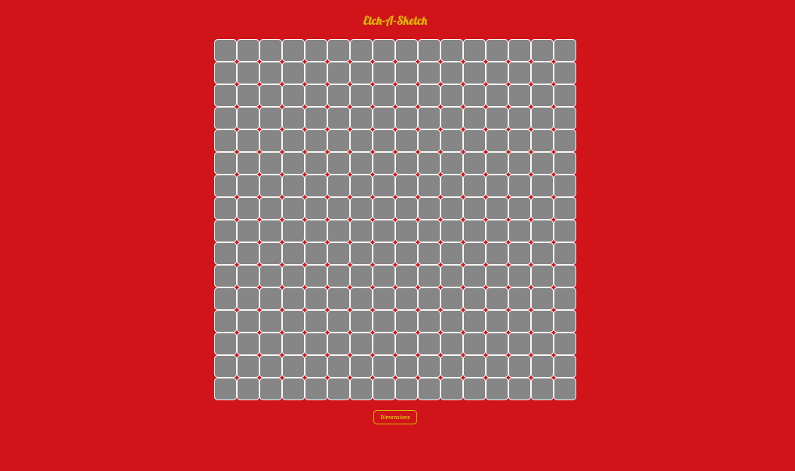
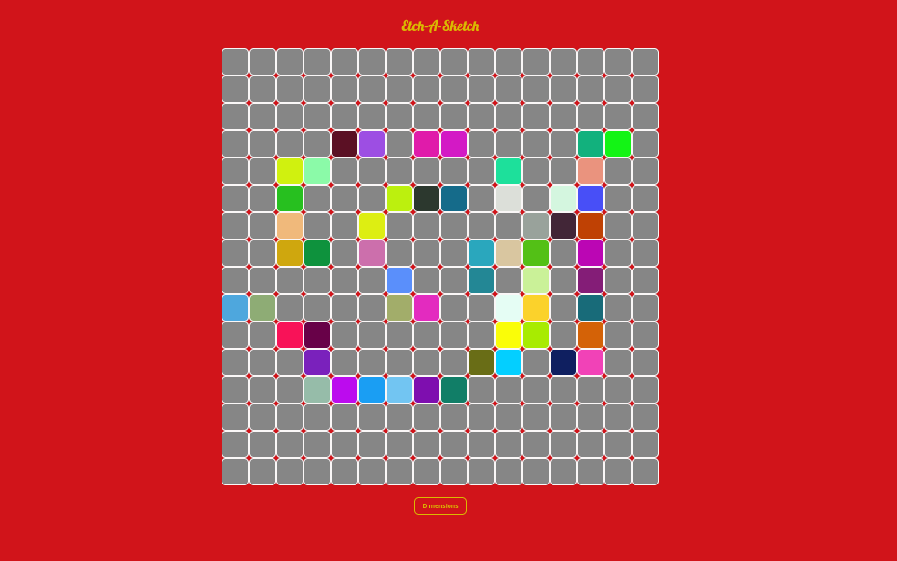

# Etch-a-Sketch
A simple webpage simulating an old school Etch-a-Sketch with random colors using flexbox
and some extra animations just for fun!

## [Live Preview](https://gerardosalinas.github.io/Etch-a-Sketch/ "Let's go!")

## Final Result
  

